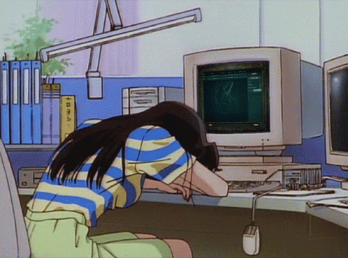

<div align="center">



# ⚡ NetRunSecurity ⚡

**`Offensive Security · Penetration Testing · Public Speaking`**

[](https://www.netrunsecurity.com)
[](https://blog.netrunsecurity.com)
[](https://wiki.netrunsecurity.com)
[](https://www.linkedin.com/company/netrunsecurity/)

</div>

```console
netrunner@mtl:~$ whoami
Offensive security consultant & hardware hacking specialist
Based in Montréal, QC 🍁 · FR/EN

netrunner@mtl:~$ uptime
5+ years breaking things professionally
150+ security assessments · 15+ conference talks
```

## 🎯 ./services --list

```yaml
technical:
  - Web Application Pentesting
  - Internal Network Assessment
  - Cloud Security: [AWS, GCP, Azure]
  - Active Directory
  - Physical Security Audit
  - Hardware & IoT Security

speaking:
  - Conference Presentations
  - Technical Workshops & Training
  - Custom Corporate Events
  - Security Awareness
```

## 🎤 ./talks --recent

| When | Where | What |
|------|-------|------|
| 2026-09 | BSides Montréal 🇨🇦 | Attending, come say hi |
| 2026-05 | NorthSec 🇨🇦 | Volunteering since 2023 |
| 2025-11 | BSides Copenhagen 🇩🇰 | Hardware Hacking Curiosity (45 min) |
| 2025-10 | Wild West Hackin' Fest, Deadwood 🇺🇸 | Hardware Hacking Curiosity · Building your S.A.O with KiCad |

## 📡 ./contact

```console
netrunner@mtl:~$ echo $CONTACT
contact [at] netrunsecurity [dot] com

netrunner@mtl:~$ exit
# hack the planet, but with a signed scope and a report at the end.
```

<div align="center">

`© NetRun Security · Montréal`

</div>